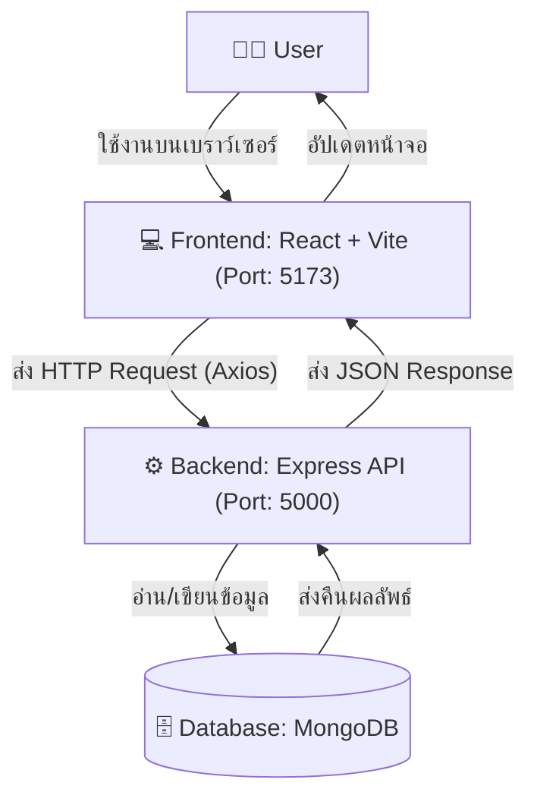

# StellarServe 🚀

StellarServe เป็นเว็บแอปพลิเคชันสำหรับจัดการการสั่งอาหารและบริการร้านอาหาร ครอบคลุมตั้งแต่ระบบจัดการร้านค้า เมนูอาหาร ตะกร้าสินค้า การสั่งซื้อ ไปจนถึงระบบรีวิว โดยแบ่งสถาปัตยกรรมออกเป็นส่วน Frontend และ Backend อย่างชัดเจน

## 🌟 Core Features
* **ระบบยืนยันตัวตน (Authentication):** รองรับการเข้าสู่ระบบและสมัครสมาชิกสำหรับทั้งลูกค้าและร้านอาหาร พร้อมการเข้ารหัสรหัสผ่านและการจัดการเซสชันด้วย JWT
* **การจัดการสินค้า/เมนู (Items Management):** ร้านค้าสามารถเพิ่ม ลบ และแก้ไขข้อมูลเมนูอาหารได้ ส่วนลูกค้าสามารถเรียกดูเมนูต่างๆ ได้
* **ระบบตะกร้าสินค้า (Shopping Cart):** ผู้ใช้สามารถเพิ่มและจัดการสินค้าในตะกร้าของตนเองได้
* **การจัดการคำสั่งซื้อ (Order Management):** ลูกค้าสามารถสร้างคำสั่งซื้อ และร้านค้าสามารถอัปเดตสถานะของออเดอร์ (เช่น กำลังเตรียม, เสร็จสิ้น)
* **ระบบรีวิว (Review System):** รองรับการให้คะแนน (Rating) และเขียนรีวิวสำหรับออเดอร์ที่เสร็จสมบูรณ์แล้ว

## 💻 Tech Stack

**Frontend (Client):**
* React (v19)
* Vite
* React Router DOM (v7)
* Tailwind CSS (v4)
* Axios

**Backend (Server):**
* Node.js & Express.js (v5)
* MongoDB & Mongoose (v9)
* JSON Web Token (JWT) & bcryptjs
* CORS & dotenv

## 🏛️ System Flow Architecture



*(ระบบรัน Frontend ที่พอร์ต `http://localhost:5173` และ API Backend ที่พอร์ต `5000` โดยมีการตั้งค่า CORS เพื่อให้ Frontend สามารถส่ง Request มาได้)*

## 📂 Project Structure
* `/client` - โค้ดส่วน Frontend (React + Vite) 
* `/server` - โค้ดส่วน Backend API (Express.js) เชื่อมต่อกับ MongoDB และให้บริการ RESTful API

## 🚀 Setup and Installation

**Prerequisites:**
* Node.js
* MongoDB (ทำงานแบบ Local หรือใช้งาน MongoDB Atlas)

**1. Backend Setup (`/server`)**
```bash
cd server
npm install
```
สร้างไฟล์ `.env` ที่ root ของโฟลเดอร์ `/server` และใส่ค่าตัวแปรดังนี้:
```env
PORT=5000
MONGO_URI=your_mongodb_connection_string
JWT_SECRET=your_super_secret_key
```
รันเซิร์ฟเวอร์ (โหมด Dev):
```bash
npm run dev
```

**2. Frontend Setup (`/client`)**
```bash
cd client
npm install
```
รัน Frontend:
```bash
npm run dev
```
เข้าใช้งานแอปพลิเคชันได้ที่ `http://localhost:5173`

## 🔗 Key REST API Endpoints

### 🟢 Base
| Method | Endpoint | Description |
| :--- | :--- | :--- |
| `GET` | `/` | ตรวจสอบสถานะการทำงานของ API Server |

### 🔐 Authentication & Users (`/api/auth`)
| Method | Endpoint | Description |
| :--- | :--- | :--- |
| `POST` | `/api/auth/register` | สมัครสมาชิกใหม่ (ลูกค้า/ร้านค้า) |
| `POST` | `/api/auth/login` | เข้าสู่ระบบเพื่อรับ JWT Token และข้อมูลผู้ใช้ |
| `GET` | `/api/auth/restaurants` | ดึงรายชื่อและข้อมูลร้านอาหารที่เปิดอยู่เท่านั้น พร้อมคะแนนรีวิวเฉลี่ย |
| `GET` | `/api/auth/restaurants/:id/status` | ตรวจสอบสถานะเปิด/ปิดของร้านอาหาร |
| `PATCH` | `/api/auth/restaurants/:id/toggle` | เปลี่ยนสถานะเปิด/ปิดร้านอาหาร (ต้องใช้ Token) |
| `PATCH` | `/api/auth/profile/:id` | อัปเดตข้อมูลโปรไฟล์ผู้ใช้ เช่น ชื่อ เบอร์โทร ที่อยู่ รูปภาพ (ต้องใช้ Token) |

### 🍔 Items & Menus (`/api/items`)
| Method | Endpoint | Description |
| :--- | :--- | :--- |
| `POST` | `/api/items` | เพิ่มเมนูอาหารใหม่สำหรับร้านค้า (ต้องใช้ Token) |
| `GET` | `/api/items` | ดึงข้อมูลเมนูอาหารทั้งหมดจากทุกร้านสำหรับลูกค้า |
| `GET` | `/api/items/restaurant/:id` | ดึงรายการเมนูอาหารเฉพาะของร้านนั้นๆ |
| `PUT` | `/api/items/update/:id` | แก้ไขข้อมูลและรายละเอียดเมนูอาหาร (ต้องใช้ Token) |
| `DELETE` | `/api/items/delete/:id` | ลบเมนูอาหารออกจากระบบ (ต้องใช้ Token) |

### 🧾 Orders (`/api/orders`)
| Method | Endpoint | Description |
| :--- | :--- | :--- |
| `POST` | `/api/orders` | สร้างคำสั่งซื้อใหม่จากลูกค้า (ต้องใช้ Token) |
| `GET` | `/api/orders/customer/:id` | ดึงประวัติคำสั่งซื้อทั้งหมดของลูกค้า พร้อมเช็คสถานะการรีวิว (ต้องใช้ Token) |
| `GET` | `/api/orders/restaurant/:id` | ดึงรายการคำสั่งซื้อทั้งหมดที่เข้ามายังร้านค้านั้นๆ (ต้องใช้ Token) |
| `PATCH` | `/api/orders/:id/status` | ร้านค้าอัปเดตสถานะออเดอร์ เช่น pending, preparing, ready, completed (ต้องใช้ Token) |

### ⭐ Reviews (`/api/reviews`)
| Method | Endpoint | Description |
| :--- | :--- | :--- |
| `POST` | `/api/reviews` | สร้างรีวิว (ให้คะแนนและคอมเมนต์) สำหรับออเดอร์ที่เสร็จสมบูรณ์แล้ว (ต้องใช้ Token) |
| `GET` | `/api/reviews/restaurant/:restaurantId` | ดึงข้อมูลรีวิวทั้งหมดของร้านอาหาร |
| `GET` | `/api/reviews/order/:orderId` | ดึงข้อมูลรีวิวเฉพาะของออเดอร์นั้นๆ |

### 🛒 Shopping Cart (`/api/cart`)
| Method | Endpoint | Description |
| :--- | :--- | :--- |
| `GET` | `/api/cart/:customerId` | ดึงข้อมูลตะกร้าสินค้าปัจจุบันของลูกค้า (ต้องใช้ Token) |
| `POST` | `/api/cart/sync` | สร้าง, อัปเดต หรือเคลียร์ข้อมูลตะกร้าสินค้า (ต้องใช้ Token) |
